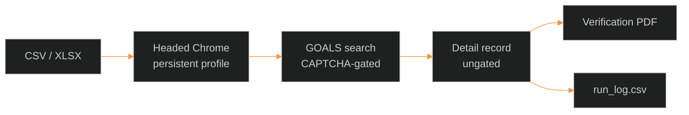

<div align="center">


# Anaga Automation

**Primary-source license verification for Georgia Behavior Analysts.**

Headed Chrome. Public GOALS. One tab. CSV in — PDF and an audit log out.

<br/>


<br/>

|  |  |  |
| :---: | :---: | :---: |

</div>

---

> [!IMPORTANT]
> This is a **credentialing control**, not a scraper toy. Every PDF is a point-in-time primary-source document. If the license number on the page does not match the request, **no file is written**.

<table>
<tr>
<td>

**Green**

Chrome opens. Dropdowns set. Search clicks. PDF lands in `output/`.

</td>
<td>

**Amber**

Cloudflare checkbox. Click **once**. Wait. Do not refresh. Do not mash.

</td>
<td>

**Red**

No stealth. No captcha solvers. No Aura API replay. No headless Search.

</td>
</tr>
</table>

---

## The job

Credentialing still does this by hand:

```
GOALS search  →  Profession = Behavior Analyst
              →  License Type = Behavior Analyst
              →  License number
              →  Search  →  open record
              →  verify status / type / issued / expires
              →  Ctrl+P into the provider folder
```

This repo is that walk — against the **live** Experience Cloud app, not the marketing site.

<p align="center">
  <a href="https://goals.sos.ga.gov/GASOSOneStop/s/licensee-search"></a>
</p>



---

## Built

<table>
<tr>
<td width="50%" valign="top">

### Pipeline

| | |
| :--- | :--- |
| **In** | CSV or XLSX of license numbers |
| **Browser** | One headed window, persistent profile, sequential |
| **Form** | Profession → License Type → number → Search |
| **Match** | Exactly one row; number must equal the request |
| **Scrape** | Name, status, type, issued, expires |
| **PDF** | Page as printed — not re-typeset |
| **Name** | `Name - GA - License Type - MM-DD-YYYY.pdf` |
| **Log** | One `run_log.csv` row per input; `failures.csv` to retry |

</td>
<td width="50%" valign="top">

### Guardrails

| | |
| :--- | :--- |
| **DOM** | Salesforce shadow roots + SLDS `<button>` comboboxes |
| **reCAPTCHA v3** | Trusted clicks only — never forged |
| **Cloudflare** | Bot pauses; you click once |
| **Pace** | ~100 / hour, jittered delays |
| **Breaker** | Three recaptcha fails → halt the run |
| **Expired** | Still capture PDF; flag it |
| **Resume** | Skip licenses that already have a good PDF |
| **Tests** | `O'Brien`, `Smith-Dogbey`, blank expiry, path length |

</td>
</tr>
</table>

<p align="center">


</p>

---

## Cockpit

```text
anaga-automation/
│
├── config.yaml              pacing, paths, lookup mode
├── data/sample_input.csv    LBA000602  +  LBA999999 (miss)
├── src/                     browser · search · detail · naming · log
├── tests/                   filename + parser contracts
├── spike/                   Phase 0 — one search, many details?
└── output/                  gitignored  ·  PDFs  ·  run_log.csv
```

### Boot

```powershell
python -m pip install -r requirements.txt
python -m playwright install chromium
$env:PYTHONPATH = "src"
python -m pytest tests
python -m main --config config.yaml
```

Leave the Chrome window on screen. Do not close it mid-run.

### Acceptance seeds

| License | Must happen |
| :---: | :--- |
| `LBA000602` | PDF `Andrea Smith - GA - Behavior Analyst - 08-31-2027.pdf` |
| `LBA999999` | `NOT_FOUND` · **zero** PDF |

---

## Still open

> [!WARNING]
> **v0.1 is a local cockpit.** Live GOALS is not signed off. Do not fire the full roster until this list is closed.

| State | Work | Why it blocks production |
| :---: | :--- | :--- |
| **NOW** | Live acceptance | Known-good PDF + invalid miss + 25 licenses, no unhandled crash. First sessions died on Cloudflare and Profession Type. |
| **NOW** | Phase 0 spike | One board-wide Search that unlocks every detail would drop later CAPTCHAs. Unproven. Stay on `lookup_mode: per_license`. |
| **NOW** | Gate reliability | Search is still recaptcha + Cloudflare. Headed Chrome + one human checkbox is the allowed path. |
| **NOW** | PDD calls | Real input path, flat vs per-provider folders, date format, hyphen vs en dash, assistant/temporary types, skip vs recapture. |
| **NOW** | Print PDF | Confirm headed Chrome writes a readable verification PDF on target PCs. |
| later | Scheduler / GUI | Out of this repo. Wrap with Task Scheduler if needed. |
| later | Production files | Point `input_file` / `output_root` at real shares. Never commit them. |

---

## Non-negotiable

> [!CAUTION]
> Break these and either the site blocks you or the packet is not a verification.

```diff
- Solve, bypass, or forge CAPTCHA
- POST the Salesforce Aura API (fwuid rotates)
- Cache detail URL tokens across runs
- Write a PDF when scraped number ≠ requested number
- Headless Chrome on Search
- Parallel tabs or parallel processes against GOALS
```

```diff
+ Headed Chrome · one tab · human pace
+ Cloudflare: one click, then wait
+ Positive license-number match before any PDF
+ Every input row gets a log line — including failures
```

---

## Knobs

```yaml
input_file: "data/sample_input.csv"
input_column: "license_number"
output_root: "output"
on_existing_file: "skip"       # skip | version | overwrite
lookup_mode: "per_license"     # roster only after Phase 0
search_click_mode: "auto"      # human = you click Search
headed: true
```

`--human-search-click` is a fallback. Default is the bot clicking Search.

---

<div align="center">

**Next move:** green `LBA000602` on live GOALS, then the 25-license batch.

<sub>Anaga Automation · Georgia SOS · Behavior Analyst · public primary source</sub>

</div>
