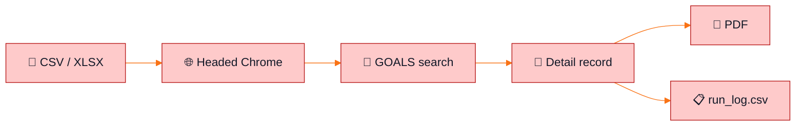

<div align="center">

# 🍑 Anaga Automation

### Georgia SOS · Behavior Analyst license verification


**CSV in → live primary-source lookup → verification PDF + run log out.**

No GUI. No database. No captcha-solving service.

</div>

---

> [!TIP]
> **Green path:** Chrome opens, form fills itself, Search clicks, PDF lands in `output/`.  
> **Yellow path:** Cloudflare shows a box — click it **once**, wait, do not mash it.  
> **Red path:** do not add stealth, solvers, or Aura API hacks.

---

## 🎯 Why this exists

Credentialing still walks the Georgia board by hand:

`open search → Profession Type → License Type → license number → Search → open record → check status / type / issued / expires → Ctrl+P`

This repo is that walk, scripted against the **live GOALS app**  
[`goals.sos.ga.gov`](https://goals.sos.ga.gov/GASOSOneStop/s/licensee-search) — not the marketing pages on `sos.ga.gov`.



---

## ✅ What is already built

<table>
<tr>
<td width="50%" valign="top">

### 🟢 Pipeline

- Reads license numbers from **CSV or XLSX**
- One headed Chrome window, **persistent profile**, **one tab**
- Selects **Behavior Analyst** profession + license type
- Types the license number and clicks **Search**
- Opens the record only when there is **exactly one match**
- Scrapes name, status, type, issued, expires
- Saves a **primary-source PDF** (page as-is)
- Filename:  
  `Name - GA - License Type - MM-DD-YYYY.pdf`

</td>
<td width="50%" valign="top">

### 🟢 Safety nets

- Salesforce **shadow DOM** + SLDS dropdowns
- Invisible **reCAPTCHA v3** — real clicks, no forge
- **Cloudflare pause** — you click once; bot waits
- ~**100 lookups / hour**, human-pace delays
- Recaptcha **circuit breaker** (3 strikes → stop)
- Expired / lapsed still get a PDF + flag
- Resume without duplicating good PDFs
- Unit tests: `O'Brien`, `Smith-Dogbey`, blank expiry, long paths

</td>
</tr>
</table>

<p align="center">
  
  
  
  
</p>

### 📁 Layout

```text
anaga-automation/
├── README.md                 ← you are here
├── config.yaml               ← paths, pacing, lookup mode
├── data/sample_input.csv     ← LBA000602 + invalid LBA999999
├── src/                      ← CLI, browser, search, detail, naming, logs
├── tests/                    ← filename + parser tests
├── spike/                    ← Phase 0 roster / token experiment
└── output/                   ← gitignored PDFs + run_log.csv
```

### ▶️ Run it

```powershell
python -m pip install -r requirements.txt
python -m playwright install chromium
$env:PYTHONPATH = "src"
python -m pytest tests
python -m main --config config.yaml
```

Leave the Chrome window open.

| Sample license | Expected |
| :---: | :--- |
| 🟢 `LBA000602` | PDF `Andrea Smith - GA - Behavior Analyst - 08-31-2027.pdf` |
| 🔴 `LBA999999` | `NOT_FOUND` in the log, **no** PDF |

---

## 🟡 What still needs to be done

> [!WARNING]
> **v0.1 is usable locally. The live GOALS site is not fully green yet.**  
> Do not point this at the full roster until the list below is closed.

| | Item | Why it matters |
| :---: | :--- | :--- |
| 🟠 | **Live acceptance** | `LBA000602` PDF + invalid `NOT_FOUND` + 25-license batch with zero crashes. First runs died on Cloudflare and the Profession dropdown. |
| 🟠 | **Phase 0 spike** | One board-wide search that unlocks every detail page would skip CAPTCHA after the first Search. Not proven. Keep `lookup_mode: per_license` until it is. |
| 🟠 | **Cloudflare / recaptcha** | Search is still gated. Headed Chrome + one human checkbox is the allowed path. No solvers. No stealth. |
| 🟠 | **PDD decisions** | Real input file, flat vs per-provider folders, `MM-DD-YYYY` vs `YYYY-MM-DD`, hyphen vs en dash, assistant/temporary types, skip vs recapture PDFs. Defaults live in `config.yaml`. |
| 🟠 | **PDF check on Windows** | Confirm headed Chrome actually writes a readable print PDF. |
| ⚪ | **Scheduler / GUI** | Out of scope. Wrap with Task Scheduler later if you want. |
| ⚪ | **Production data** | Point `input_file` and `output_root` at real folders. Never commit those files. |

---

## 🛑 Hard rules — do not “fix” these

> [!CAUTION]
> Breaking these gets the run blocked or the verification thrown out.

```diff
- Bypass, solve, or forge CAPTCHA
- Call the Salesforce Aura API directly (fwuid rotates)
- Cache detail URL tokens across runs
- Write a PDF if the scraped license number ≠ the request
- Run Search in headless Chrome
- Parallel tabs / parallel processes against GOALS
```

```diff
+ Headed Chrome, one tab, human pace
+ Pause on Cloudflare — one checkbox click, then wait
+ Match license number before any PDF
+ Log every input row, including failures
```

---

## ⚙️ Config you will actually change

```yaml
input_file: "data/sample_input.csv"
input_column: "license_number"
output_root: "output"
on_existing_file: "skip"       # skip | version | overwrite
lookup_mode: "per_license"     # roster only after Phase 0 succeeds
search_click_mode: "auto"      # human = you click Search
headed: true
```

`--human-search-click` is optional. Use it only if auto Search keeps getting rejected.

---

<div align="center">

### 🚦 Status


**Next:** green the sample run on live GOALS, then close the 25-license acceptance list.

<br/>

<sub>Anaga Automation · Georgia Behavior Analyst · public primary-source verification</sub>

</div>
